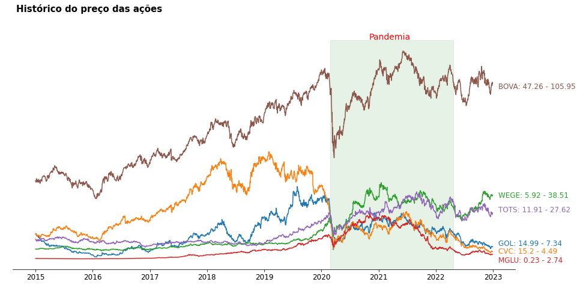
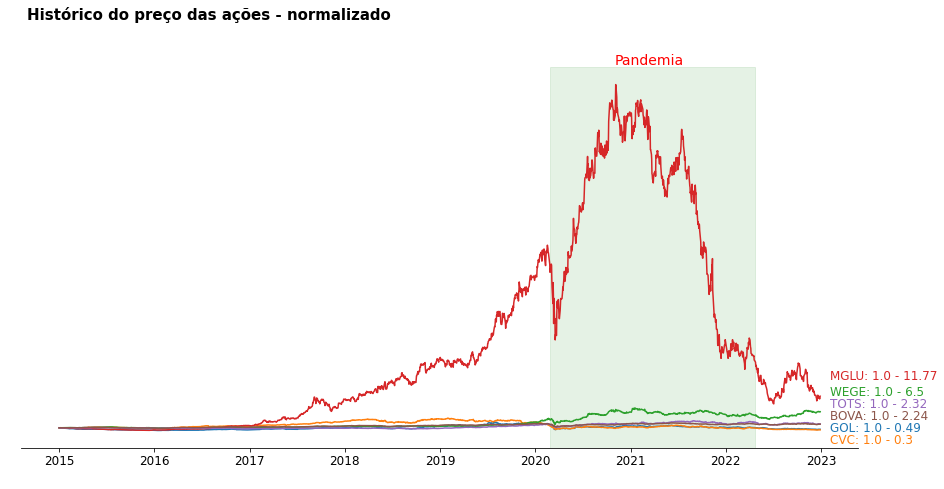
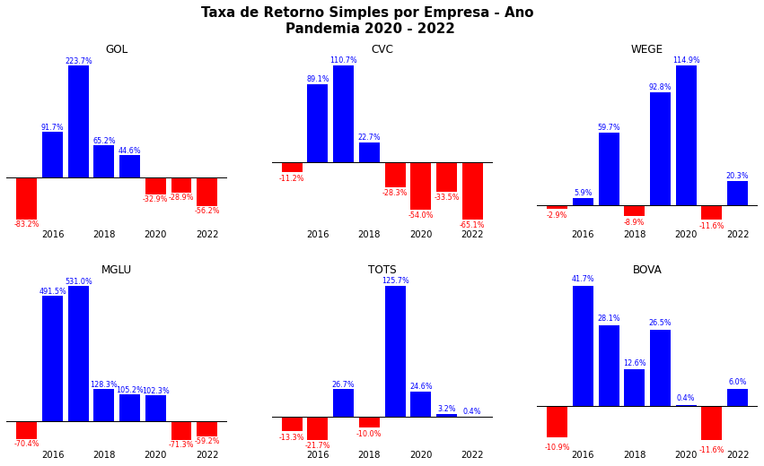
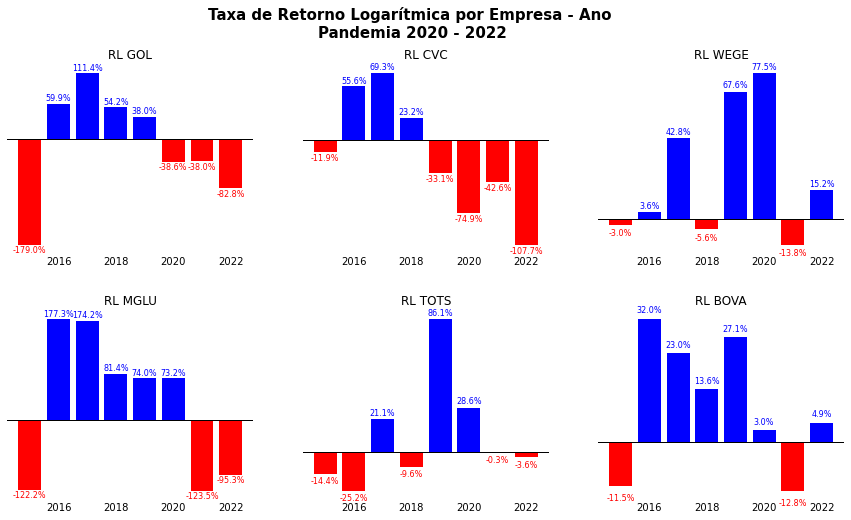
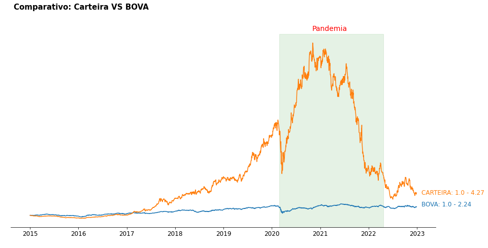

# Análise do Comportamento da Carteira de Ações - Finanças parte 1
Este repositório contém script em python para o cálculo de retorno simples, retorno logarítmico e retorno da carteira de ações

 

# _Objetivo do projeto_

Extrair os preços de ações da internet para observar o comportamento da carteira de ações no período de 2015 até 2022 das empresas:

- GOLL4.SA;
- CVCB3.SA;
- WEGE3.SA;
- MGLU3.SA;
- TOTS3.SA;
- BOVA11.

 

# _1. Problema de Negócio_

O mercado financeiro é um ambiente extremamente complexo e dinâmico, onde investidores buscam constantemente informações e insights para tomarem decisões mais informadas. O comportamento das ações é um dos principais indicadores para investidores avaliarem a saúde de uma empresa, bem como as tendências do mercado como um todo.

E o problema é a dificuldade em compreender o comportamento da carteira de ações ao longo do tempo, o que prejudica a tomada de decisão estratégica em relação aos investimentos.

Fonte: Biblioteca yFinance

 

# _2. Justificativa_

- **Por quê:** O comportamento das ações é um dos principais indicadores para investidores avaliarem a saúde de uma empresa, bem como as tendências do mercado como um todo. Portanto, é fundamental que os investidores compreendam o comportamento de sua carteira de ações ao longo do tempo para tomar decisões estratégicas de investimento.
- **Como:** Utilizando técnicas de ciência de dados, será possível extrair insights valiosos a partir dos preços de ações coletados, que permitirão compreender o comportamento da carteira de ações no período de 2015 até 2022. O processo incluirá a coleta e análise dos dados, a seleção dos melhores métodos e a entrega dos resultados em um relatório e arquivos de dados.
- **O quê:** A solução consiste em analisar a taxa de retorno simples, logarítmica e retorno de carteira de ações para compreender o comportamento da carteira de ações no período de 2015 até 2022. A entrega dos resultados será realizada por meio de um relatório detalhando os insights gerados pela análise de dados, incluindo gráficos e visualizações que auxiliem na compreensão dos resultados. Essa solução possibilitará que investidores tomem decisões mais informadas e estratégicas em relação à carteira de ações.

 

# _3. Premissas_

As variáveis originais do conjuto de dados são: 

Variável | Definição
------------ | -------------
Date | data que teve negociações na bolsa de valores|
Open | valor de abertura|
Close | valor no final do dia|
Low | menor valor que atingiu no dia|
Volume | quantidade de ações negociada no dia|
Adj Close | fechamento ajustado, ou seja indica qual o preço real no final do dia (aqui leva em consideração os dividendos da empresa que pode influênciar no fechamento da ação.)|

Aos feriados e finais de semana a bolsa de valores é fechado e não há negociação nesse dia, então vamos ter datas somente nos dias que teve negociação.

Dividendos é uma fatia dos lucros que as empresas pagam para os acionistas.

**Mas vamos criar um dataframe, somente com a coluna 'Close'.**

 

# _4. Planejamento da Solução_

0. **ENTENDIMENTO DO NEGÓCIO**

Definição do problema: É importante definir claramente qual é o problema a ser resolvido ou a pergunta a ser respondida. É preciso entender o objetivo do projeto e a relevância do problema.

    - Descrição do negócio
    - Planejamento da solução

1. **IMPORTANDO AS BIBLIOTECAS**

Importação de bibliotecas: Nesta etapa, as bibliotecas necessárias para o desenvolvimento do modelo de machine learning são importadas. Isso inclui bibliotecas para manipulação de dados, visualização, modelagem e avaliação.

2. **COLETA DOS DADOS**

Coleta de dados: Nesta etapa, os dados são coletados a partir de diversas fontes, como bases de dados, APIs, arquivos de texto, imagens, etc.

3. **LIMPEZA DOS DADOS**

Limpeza dos dados: Esta etapa consiste na descrição estatística dos dados coletados, como média, mediana, desvio padrão, entre outros. É importante entender os dados coletados, avaliar a qualidade dos dados e identificar quaisquer problemas ou limitações.

    - **1:** Coluna
    - **2:** Dimensões de dados
    - **3:** Tipos de dados
    - **4:** Verificando dados nulos
    - **5:** Estatística descritiva

4. **ANÁLISE EXPLORATÓRIA DOS DADOS**

Análise exploratória de dados: Nesta etapa, os dados são visualizados e analisados graficamente para identificar padrões e relações entre as variáveis.

    - **1:** Histograma
    - **2:** Boxplot
    - **3:** Gráfico de linhas
    - **4:** Normalização
    - **5:** Taxa de retorno simples
    - **6:** Taxa de retorno diária
    - **7:** Taxa de retorno anual
    - **8:** Taxa de retorno logarítmica
    - **9:** Taxa de retorno logarítmica - diária
    - **10:** Taxa de retorno logarítmica - anual
    - **11:** Retorno de carteira de ações

5. **INSIGHTS**

Nesta etapa, são identificadas as principais descobertas e conclusões do projeto.

6. **PRÓXIMOS PASSOS**

Nesta etapa, são definidos os próximos passos a serem tomados com base nos resultados obtidos e nos insights identificados. Isso pode incluir melhorias no modelo existente, coleta de mais dados, exploração de diferentes modelos, entre outros.

 

# _5. Insights_

*Resumo dos insights durante análise exploratória de dados (EDA):*

**Gráfico para visualizar o histórico das ações.**

 

**Nota:**
- As ações da MGLU talves tenha subido devido a quarentena, onde as pessoas passaram a comprar online.
- Não podemos fazer um comparativo entre as ações, porque elas estão em uma escala diferentes, para fazer uma comparação mais justa entre elas, devemos usar um conceito de normalização.
- Objetivo: é fazer todas as ações começar no mesmo ponto e depois calcular o crescimento proporcional de cada uma das ações e ter condições em responder uma pergunta. **Em qual ação eu posso ganhar mais dinheiro?**

**Gráfico para saber qual ação podemos ganhar mais dinheiro.**

 

**Nota:**
- Depois da normalização, podemos de certa forma medir quantas vezes o seu dinheiro aumentou caso tenha investido nessa empresa.
- Agora ficou muito melhor para verificar a taxa de crescimento de cada ação.
- Podemos ver que a MGLU está disparada na frente de todas as outras ações e em segundo lugar temos a WEGE.
- Esse é um gráfico bem útil onde podemos fazer análise de como a sua carteira de investimento está se comportando.

**Gráfico da taxa de retorno simples.**

 

**Nota:**
- Observando o cenário das empresas, podemos ver que a CVC sofreu mais no período da pandemia.
- A ação da MGLU teve um crescimento bastante expressivo, mas em 2022 teve uma taxa de retorno negativa sendo a segunda empresa com o menor retorno em 2022.

**Gráfico da taxa de retorno logarítmica.**

 

**Nota:**
- Observando o cenário das empresas, podemos ver que a CVC sofreu mais no período da pandemia.
- A ação da MGLU teve um crescimento bastante expressivo, mas em 2022 teve uma taxa de retorno negativa sendo a segunda empresa com o menor retorno em 2022.

**Gráfico do retorno de carteira de ações.**

 

**Nota:**
- Podemos chegar na conclusão que nesse cenário é mais interessante nós investirmos em uma carteira com essas cinco empresas, do que investir nas empresas que estão na BOVESPA.

 

# _6. Conclusão_

**Com base nos valores apresentados, podemos concluir que:**

- As ações da WEGE e MGLU apresentaram as maiores taxas de retorno anual logarítmica, com 23,18% e 30,52%, respectivamente;
- As ações da CVC apresentaram a menor taxa de retorno anual logarítmica, com -15,10%, o que indica que o investimento nessa empresa resultou em perda de valor no período analisado;
- As ações da GOL, TOTS e BOVA apresentaram taxas de retorno anual logarítmica próximas a 10%, o que indica um desempenho relativamente positivo desses ativos no período.

**Retorno de carteira de ações:**

- Retorno anual da carteira considerando que nós fizemos investimentos em todos os ativos da carteira.
- Nós queremos medir a taxa de retorno da carteira de ações sem considerar a ação da BOVA.
- Temos o valor de 24%, isso indica que o retorno médio anual da nossa carteira, considerando essas cinco empresas (GOL, CVC, WEGE, MGLU, TOTS) é de 24%.
- Não consideramos a BOVA nessa carteira, pois é interessante fazer uma análise no seguinte sentido:
    - Se você investir nessas cinco empresas, vamos ter um retorno médio anual de 24%
    - Se investir na BOVA, que é um conjunto com várias ações o retorno é de 13%
    - Podemos chegar na conclusão que nesse cenário é mais interessante nós investirmos em uma carteira com essas cinco empresas, do que investir nas empresas que estão na BOVESPA.

**Algumas considerações:**

- MGLU
    - Analisando a taxa de crescimento com dados normalizados a MGLU está disparada na frente de todas
    - O resultado da taxa de retorno simples (TRS) de 1076.92% para a ação **MGLU** no período de 2015-01-01 até 2022-12-31 é bastante expressivo e indica que houve uma valorização significativa no preço dessa ação durante esse período.
    - Se um investidor tivesse comprado essa ação no início do período (2015-01-02) e vendido no final do período (2022-12-30), ele teria obtido um retorno de 1076.92% sobre o capital investido.
    - A ação da MGLU teve um crescimento bastante expressivo, mas em 2022 teve uma taxa de retorno negativa sendo a segunda empresa com o menor retorno em 2022.

- CVC
    - Com base na taxa de retorno anual calculada para cada ativo a CVC apresenta a menor taxa de retorno. Observando o cenário das empresas, podemos ver que a CVC sofreu mais no período da pandemia.

- Observando min e max, podemos ver um intervalo muito grande entre os valores das ações, isso sugere que há uma grande variação entre os valores no período observado.

 

# _7. Próximos passos_

Fazer o cálculo do risco das ações e para calcular o risco de uma ação, nós utilizamos algumas medidas e estatísticas, como:

- Variância,
- Desvio Padrão,
- Coeficiente de variação,
- Covariância e Correlação.
